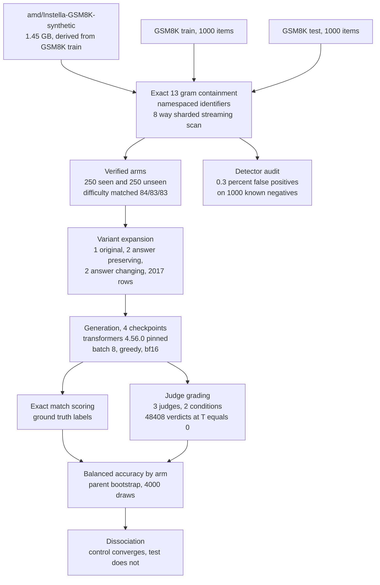

# Verified Training Set Membership Degrades LLM Judge Accuracy Only When the Reference Answer Is Withheld

**Submission target.** JUDGe 2026, Can We Trust the Judge, NeurIPS 2026 workshop, Atlanta,
12 to 13 December 2026. Non archival. Double blind via OpenReview. Full paper, 6 pages plus
references.

**Topic match.** Construct validity in LLM based evaluators (listed first in the call);
robustness to meaning preserving paraphrase; reasoning chain validity in complex task
evaluation.

---

## Abstract

Large language models are increasingly used to grade the outputs of other models, yet the
judge is itself a trained artifact whose competence may depend on whether it has seen the item
under evaluation. Existing audits of judge reliability characterise position bias, verbosity
bias, self preference, and generator to judge relatedness, but none establish membership of the
graded item in the judge's own training corpus, because the corpora of the models normally used
as judges are not public.

This work resolves that by measuring judge accuracy against exactly verified membership.
The AMD Instella family publishes its complete pretraining mixture, and its stage 2 corpus is
derived from GSM8K train and not from GSM8K test. Membership of each graded item is therefore
established by exact 13 gram containment rather than inferred, giving 250 verified seen and 250
verified unseen problems with a measured detector false positive rate of 0.3 percent on known
negatives.

Three judges of increasing capability (Instella-3B-Instruct, Qwen2.5-7B-Instruct,
Qwen2.5-14B-Instruct) grade 48,408 candidate solutions under two conditions. In the reference
free condition the gold answer is withheld and the judge must evaluate the reasoning. In the
reference based condition the gold answer is supplied, which reduces grading to comparison and
serves as a control, since memorisation of a solution cannot operate when the solution is given.

A dissociation emerges. Once a judge is competent, defined as balanced accuracy between 0.90
and 0.98 in the reference based condition, the membership gap in that condition converges toward
zero, moving from minus 0.122 to minus 0.002 to plus 0.008 across the capability ladder. In the
reference free condition the gap does not converge and scale does not rescue it, running minus
0.081, minus 0.200, minus 0.184. Judges grade problems present in their own training data
substantially less accurately, and only when denied the reference answer.

The pattern is consistent with substitution of recall for verification: the judge compares a
candidate solution against the answer it remembers instead of checking the reasoning presented,
and on numerically perturbed variants the remembered answer is wrong. Two negative controls
support this reading. A design testing only the reference free condition would report the gap as
an unqualified judge property; a design testing only a 3 billion parameter judge would find a
gap in both conditions and reach the opposite conclusion.

---

## 1 Introduction

The LLM as judge paradigm rests on an assumption that is rarely tested: that the evaluator's
reliability is independent of the material it evaluates. If a judge has memorised a benchmark
item, its verdict on a candidate solution to that item may reflect recall rather than
assessment. The verdict would then be a measurement whose calibration depends on the thing being
measured.

Testing the assumption requires knowing what the judge was trained on. For the closed weight
models typically used as judges this is unavailable, so prior work has necessarily studied
proxies. Zheng et al. [1] characterise position, verbosity, and self enhancement biases. Li et
al. [2] identify preference leakage, a contamination problem defined by relatedness between the
synthetic data generator and the evaluator, explicitly not by membership of the graded item in
the judge's corpus. Norman et al. [3] evaluate 21 judges across roughly 541,000 judgments and
find that high test retest reliability coexists with severe position bias, establishing that
reliability does not imply validity. None of these studies can condition on verified membership.

The AMD Instella family [4] makes the conditioning possible. AMD publishes the complete
pretraining mixture, and the stage 2 component `amd/Instella-GSM8K-synthetic` is derived from
GSM8K train and not from GSM8K test. Membership of a GSM8K item in the training corpus can
therefore be established by exact string overlap rather than estimated by a membership inference
attack.

**Contributions.**

1. The first measurement of LLM judge accuracy conditioned on exactly verified membership of the
   graded item in a training corpus, over 48,408 verdicts.
2. A dissociation between the reference free and reference based conditions that isolates the
   effect and rules out distributional explanations.
3. A capability ladder demonstrating that the effect is not an artifact of weak judges, and that
   a single weak judge produces the opposite conclusion.
4. A documented instance of the kappa paradox producing a spurious and statistically significant
   membership effect, retained as a methodological caution for this class of study.

---

## 2 Related Work

**Judge reliability and bias.** Zheng et al. [1] introduce MT Bench and Chatbot Arena, report
that frontier judges reach above 80 percent agreement with human preference, and identify
position, verbosity, and self enhancement biases. Norman et al. [3] extend this to a systematic
audit across 21 judges and three benchmarks, using Cohen's kappa, Krippendorff's alpha, position
bias measured as the deviation of paired outcome probability from one half, and test retest
reliability. They report same verdict rates above 95 percent at temperature 0 falling to
approximately 70 percent at temperature 1, which motivates holding the judge at temperature 0
throughout the present work.

**Contamination in judging.** Li et al. [2] define preference leakage as bias arising when the
data generator and the evaluator are the same model, share an inheritance relationship, or belong
to one family. The mechanism is relatedness between models, not membership of the evaluated item
in the evaluator's training data, and the paper does not test the latter.

**Contamination detection.** The n gram overlap family originates with Brown et al. [5], who
flag an item when any of its n grams appears in the corpus. Perplexity based membership inference
is developed by Carlini et al. [6] and Shi et al. [7]. Yang et al. [8] show that n gram filtering
misses rephrased contamination. All of these estimate membership; the present setting establishes
it, which is what permits the detector false positive rate to be measured rather than assumed.

**Reasoning robustness.** Mirzadeh et al. [9] introduce GSM Symbolic and hypothesise that models
replicate reasoning steps from training data rather than reasoning, reporting drops up to 65
percent when an irrelevant clause is added. Ivanova [10] challenges the statistical basis,
finding that for 21 of 25 models there is insufficient evidence to reject equality of performance
between GSM8K and GSM Symbolic. The perturbation apparatus used here follows [9]; the statistical
posture follows [10].

---

## 3 Method

### 3.1 Establishing membership

For each candidate item the prompt is normalised to lowercase alphanumeric tokens and decomposed
into every window of 13 consecutive tokens. Containment is the fraction of those windows
occurring anywhere in the 1.45 GB training corpus, computed in a single streaming pass with a
rolling polynomial hash over a 61 bit Mersenne prime, so cost is linear in corpus tokens and
memory is linear in item windows.

An item with containment at or above 0.80 is labelled seen; at or below 0.10, unseen. Items
between the thresholds are excluded from both arms rather than assigned to one, on the principle
that an indefensible treatment label damages an analysis more than a smaller sample does. The 13
gram window follows Brown et al. [5].

Identifiers require care. GSM8K train and test share the scheme `gsm8k_NNNNN`, so loading 1,000
items from each collides across all 1,000. Keying the gram index by bare identifier causes the
numerator to accumulate matches against windows absent from the denominator, and containment, a
fraction bounded above by one, reaches 7.78. All measurement here uses identifiers namespaced by
split.

### 3.2 Verifying the detector

Because the corpus is derived from GSM8K train, every GSM8K test item is a known negative and
cannot be contaminated. The false positive rate of any containment threshold is therefore
measurable.

| rule | train flagged | test flagged | false positive rate |
|---|---|---|---|
| any 13 gram match, following [5] | 866 of 1000 (86.6 percent) | 3 of 1000 | **0.3 percent** |
| containment at or above 0.50 | 584 (58.4 percent) | 1 | 0.1 percent |
| containment at or above 0.80, used here | 303 (30.3 percent) | 0 | **0.0 percent** |

Test item containment has median 0.000, 99th percentile 0.000, and maximum 0.538. Detection is
accurate, which removes an unreliable treatment label as an explanation for any result below.

### 3.3 Judge protocol

Each graded unit is a triple of problem, candidate solution, and verdict. Candidate solutions are
the generations of four Instella checkpoints on the same 2,017 item set, comprising 500 parent
problems each expanded into one original, two answer preserving rewrites, and two answer changing
numeric perturbations.

Two conditions differ only in whether the gold answer appears in the judge prompt.

- **Reference free.** The gold answer is withheld. The judge must evaluate the reasoning. This is
  the only condition in which memorisation of the problem could plausibly assist.
- **Reference based.** The gold answer is supplied, reducing the task to comparison. This is the
  control: an effect appearing here cannot be memorisation of the solution, because the solution
  is given.

The judge emits one word, CORRECT or INCORRECT, at temperature 0 with a 24 token budget. Parsing
tests the negative first, since INCORRECT contains CORRECT as a substring. A response committing
to neither is recorded as an abstention rather than as a disagreement; conflating the two would
inflate apparent reliability. Abstention rates range from 0.0 to 2.6 percent.

### 3.4 The metric, and why not kappa

Judge accuracy was first measured as Cohen's kappa against exact match ground truth. The result
appeared decisive and was wrong.

| judge | target | mode | kappa seen | kappa unseen | difference | 95 percent interval |
|---|---|---|---|---|---|---|
| Instella-3B | instruct | reference free | 0.005 | 0.173 | minus 0.168 | [minus 0.228, minus 0.113] |
| Instella-3B | stage2 | reference free | 0.011 | 0.303 | minus 0.292 | [minus 0.356, minus 0.228] |

Kappa is a function of the marginal distributions as well as of the agreement. The arms have very
different ground truth base rates: `instruct` is correct on 77 percent of seen rows against 53
percent of unseen. An arm whose base rate sits near one half has substantially more kappa
headroom than a skewed arm, so the skew alone generates the gap. This is the kappa paradox.

All results below use **balanced accuracy**, the unweighted mean of sensitivity and specificity.
Both quantities condition on the true class, so neither depends on the base rate and their mean is
comparable across arms by construction. Chance is 0.5.

### 3.5 Inference

Intervals come from a bootstrap over **parent problems**, not over rows. The five rows of one
problem are not five independent observations; the measured intraclass correlation on this data
is approximately 0.48, and resampling rows would contract intervals by roughly the design effect
of 2.4, producing confidently incorrect error bars.

### 3.6 System architecture



Reproducibility controls that are load bearing rather than incidental:

- `transformers` is pinned to exactly 4.56.0. A version range places different checkpoints on
  different minor versions, which enters the estimate as though it were a model difference.
- Batch size is fixed at 8 across all generation. Greedy bf16 decoding is sensitive to padding,
  so a batch size change alters tie breaking.
- Variants are seeded per pair of item and perturbation type, so variant text is stable
  regardless of call order and generations remain valid when the item set changes.
- Every generation batch is flushed and fsynced, and resume is keyed on item identifier, so an
  interrupted run continues rather than restarting.

---

## 4 Results

### 4.1 The dissociation

Balanced accuracy, seen minus unseen, grading `instruct` outputs. Asterisk marks an interval
excluding zero.

| judge | reference based (control) | reference free |
|---|---|---|
| Instella-3B-Instruct | minus 0.0541 [minus 0.083, minus 0.026] * | minus 0.0809 [minus 0.109, minus 0.054] * |
| Qwen2.5-7B-Instruct | minus 0.0359 [minus 0.068, minus 0.008] * | **minus 0.2000** [minus 0.248, minus 0.149] * |
| Qwen2.5-14B-Instruct | minus 0.0230 [minus 0.057, plus 0.006] | **minus 0.1840** [minus 0.231, minus 0.133] * |

Grading `stage2` outputs, the control converges more sharply still: minus 0.1219, then minus
0.0024, then plus 0.0077, the last two spanning zero.


*Figure 1. Reference based grading converges toward zero as judge capability rises. Reference
free grading does not. Error bars are 95 percent bootstrap intervals over parent problems.*

### 4.2 Judge capability is demonstrated, not assumed

| judge | reference based, seen | reference based, unseen | reference free, seen | reference free, unseen |
|---|---|---|---|---|
| Instella-3B-Instruct | 0.5137 | 0.5678 | 0.5016 | 0.5825 |
| Qwen2.5-7B-Instruct | 0.9370 | 0.9728 | 0.5998 | 0.7998 |
| Qwen2.5-14B-Instruct | 0.9459 | 0.9689 | 0.6362 | 0.8202 |


*Figure 2. Absolute balanced accuracy up the capability ladder. The dashed line is chance.*

The 3 billion parameter judge sits within 0.04 of chance on the seen arm in every configuration,
including when handed the reference answer. Its rows therefore describe a noise floor rather than
a judge, and the substantive claims rest on the 7 and 14 billion parameter judges, which reach
0.90 to 0.98 in the control condition.

### 4.3 Three observations establish the effect

**Capability is real.** Given the reference answer, the larger judges are strong. Conclusions
about the instrument are drawn from instruments that work.

**The control behaves as a control.** As capability rises the reference based membership gap
converges toward zero. Supplying the correct answer for the specific variant removes the effect,
which is the behaviour a memorisation account predicts and a distributional account does not.

**Withholding it does not converge, and scale does not rescue it.** The reference free gap grows
once the judge is competent enough to exhibit it, then holds: minus 0.081, minus 0.200, minus
0.184. A small model artifact would shrink with capability.

### 4.4 Per cell reliability


*Figure 3. Balanced accuracy per cell of the two by two design, reference free grading. Answer
preserving rewrites leave the gold answer intact, so movement between original and perturbed
within an arm reflects judge fragility rather than task difficulty.*

### 4.5 Abstention


*Figure 4. Abstention and raw agreement plotted as separate series. Abstention stays between 0.0
and 2.6 percent, so the balanced accuracy figures are not an artifact of selective abstention.*

---

## 5 Mechanism

The pattern is consistent with substitution of recall for verification. Asked to grade a problem
present in its own training data without being told the answer, the judge appears to compare the
candidate solution against the answer it remembers rather than checking the reasoning presented.
Two thirds of the graded rows are variants, and the answer changing variants have different
correct answers from the memorised original, so a remembered answer marks correct solutions
wrong. Supplying the correct answer for the variant at hand removes the reliance on recall, and
with it the effect.

The account is inferential rather than demonstrated. Confirming it directly requires training
data attribution, establishing that the judge's verdict is influenced by the specific memorised
document. That is stated as future work in Section 6.

---

## 6 Limitations

**The `sft` anomaly is unexplained.** The effect concentrates on `stage2` and `instruct` outputs.
`stage1` outputs are wrong almost everywhere, 7 percent accuracy, and are therefore trivially
gradeable in either condition, which accounts for its null. `sft` shows no gap in either
condition despite outputs of comparable quality to `instruct`, and the present data do not
explain why.

**One model family provides the candidate solutions.** All graded outputs come from Instella
checkpoints. Whether the effect reproduces on candidate solutions from other families is untested.

**The judge and the corpus are not perfectly matched.** Membership is verified against Instella's
corpus. The Instella judge therefore has verified membership, while the Qwen judges are graded
against a corpus that is not theirs. The Qwen results establish that a competent judge exhibits
the dissociation on this item partition, but membership in the Qwen corpus is unknown. This is a
genuine asymmetry: the strongest evidence comes from judges whose own membership cannot be
verified. Resolving it requires a second open corpus model of comparable capability.

**Mechanism is inferred.** No attribution evidence links a verdict to a specific training
document. Influence function methods [11, 12, 13] would provide it at substantially greater cost.

**Two conditions, one prompt template.** Robustness of the dissociation to prompt phrasing is
untested.

---

## 7 Conclusion

Judge reliability is not independent of the material judged. On problems whose presence in a
training corpus is established by exact overlap rather than inferred, a competent judge grades
substantially less accurately, and the degradation appears only when the reference answer is
withheld. The reference based control converges toward zero as judge capability rises while the
reference free effect persists, which separates the finding from distributional explanations that
a single condition design cannot exclude.

Two negative controls carry methodological weight beyond the specific result. Cohen's kappa
produced a large and statistically significant spurious effect through the kappa paradox, and a
single 3 billion parameter judge produced the opposite conclusion by sitting at its own noise
floor in both conditions. Studies of this form require a base rate independent metric and a
demonstrably competent instrument.

---

## References

[1] L. Zheng, W. Chiang, Y. Sheng, S. Zhuang, Z. Wu, Y. Zhuang, Z. Lin, Z. Li, D. Li, E. Xing,
H. Zhang, J. Gonzalez, I. Stoica. Judging LLM as a Judge with MT Bench and Chatbot Arena.
NeurIPS 2023. arXiv:2306.05685.

[2] D. Li, R. Sun, Y. Huang, M. Zhong, B. Jiang, J. Han, X. Zhang, W. Wang, H. Liu. Preference
Leakage, A Contamination Problem in LLM as a Judge. arXiv:2502.01534.

[3] J. D. Norman, M. U. Rivera, D. A. Hughes. Reliability without Validity, A Systematic Large
Scale Evaluation of LLM as a Judge Models Across Agreement, Consistency, and Bias.
arXiv:2606.19544.

[4] J. Liu, J. Wu, X. Yu, Y. Su, P. Mishra, G. Ramesh, S. Ranjan, C. Manem, X. Sun, Z. Wang,
P. P. Brahma, Z. Liu, E. Barsoum. Instella, Fully Open Language Models with Stellar Performance.
arXiv:2511.10628.

[5] T. B. Brown et al. Language Models are Few Shot Learners. NeurIPS 2020. arXiv:2005.14165.

[6] N. Carlini, D. Ippolito, M. Jagielski, K. Lee, F. Tramer, C. Zhang. Quantifying Memorization
Across Neural Language Models. ICLR 2023. arXiv:2202.07646.

[7] W. Shi, A. Ajith, M. Xia, Y. Huang, D. Liu, T. Blevins, D. Chen, L. Zettlemoyer. Detecting
Pretraining Data from Large Language Models. ICLR 2024. arXiv:2310.16789.

[8] S. Yang, W. Chiang, L. Zheng, J. E. Gonzalez, I. Stoica. Rethinking Benchmark and
Contamination for Language Models with Rephrased Samples. arXiv:2311.04850.

[9] I. Mirzadeh, K. Alizadeh, H. Shahrokhi, O. Tuzel, S. Bengio, M. Farajtabar. GSM Symbolic,
Understanding the Limitations of Mathematical Reasoning in Large Language Models. ICLR 2025.
arXiv:2410.05229.

[10] D. R. Ivanova. On Some Fixable Limitations of Understanding the Limitations of Mathematical
Reasoning in LLMs. desirivanova.com, 22 October 2024.

[11] P. W. Koh, P. Liang. Understanding Black box Predictions via Influence Functions. ICML 2017.
arXiv:1703.04730.

[12] G. Pruthi, F. Liu, M. Sundararajan, S. Kale. Estimating Training Data Influence by Tracing
Gradient Descent. NeurIPS 2020. arXiv:2002.08484.

[13] R. Grosse, J. Bae, C. Anil, et al. Studying Large Language Model Generalization with
Influence Functions. arXiv:2308.03296.

[14] A. Yang et al. Qwen2.5 Technical Report. arXiv:2412.15115.

---

## Appendix A Complete results

All 24 configurations of three judges, four target checkpoints, and two conditions are in
`experiments/runs/fullscale-S250-v2/analysis/judge_reliability.json`, which retains the discarded
kappa figures alongside the balanced accuracy figures so the rejected metric remains inspectable.

## Appendix B Reproduction

```
modal run experiments/modal_fullscale.py::judge_run --tag instruct --mode reference_free --judge-model "Qwen/Qwen2.5-7B-Instruct"
modal run experiments/modal_fullscale.py::judge_analysis --write
modal run experiments/modal_fullscale.py::supplementary_figures
```

Total judge compute is 1.51 GPU hours on one A100 40GB for 48,408 verdicts. Raw verdicts,
generations, scores, analysis artifacts, and all 17 figures are published at
`GOVINDFROM/Instella-Reasoning` under `experiments/runs/fullscale-S250-v2`.

## Appendix C Anonymisation

Review is double blind. The repository and dataset links above identify the author and must be
replaced with an anonymous mirror before submission.
