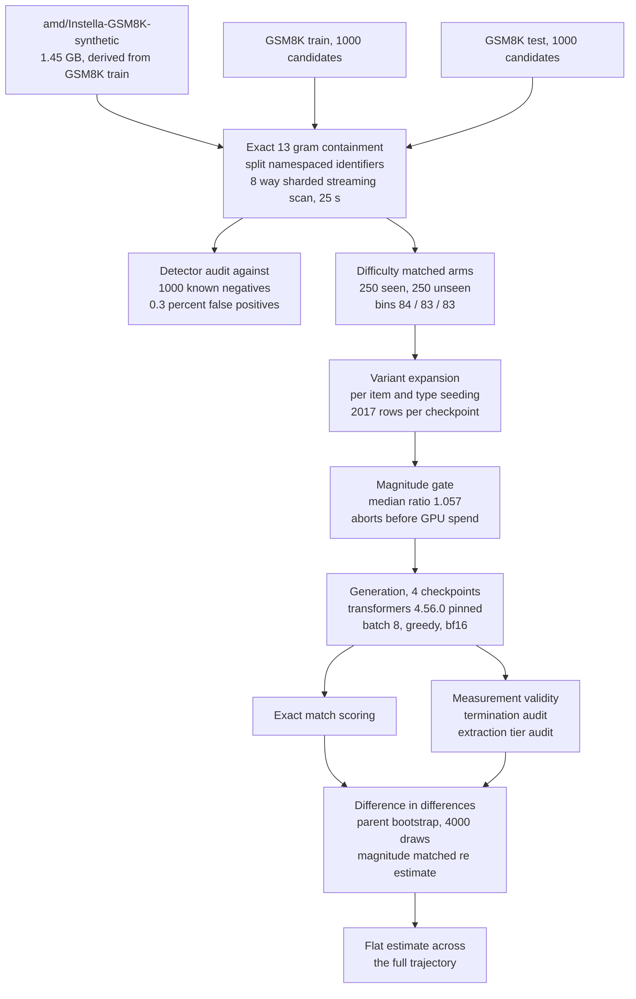

# Exactly Verified Contamination Does Not Inflate GSM8K Accuracy Across the Instella 3B Training Trajectory

**Submission target.** MATH-AI 2026, the 6th Workshop on Mathematical Reasoning and AI,
NeurIPS 2026, Atlanta, 12 or 13 December 2026. Non archival. Double blind via OpenReview. Four
pages of content plus unlimited references.

**Topic match.** Evaluating mathematical agents, assessment approaches beyond answer accuracy;
humans versus machines, comparative strengths and failure modes in mathematical reasoning.

---

## Abstract

Benchmark contamination is routinely treated as grounds for discounting a reported score. If
evaluation items appear in training data, accuracy is presumed to reflect recall rather than
reasoning. The inference is seldom tested, because membership is normally estimated from an
embedding or perplexity proxy rather than established.

This work establishes membership exactly and tests the inference directly. The AMD Instella
family publishes its complete pretraining mixture, and its stage 2 corpus is derived from GSM8K
train and not from GSM8K test. Membership of each item is therefore verified by exact 13 gram
containment against that corpus, and items whose containment falls between thresholds are
excluded from both arms rather than forced into one. Crossing verified membership with numeric
perturbation yields a difference in differences estimator that isolates the memorisation
component and cancels the integer magnitude confound. Intervals derive from a bootstrap over
parent problems, matching a measured intraclass correlation of approximately 0.48.

Across four checkpoints spanning the full training pipeline, comprising 12,468 scored generations
with 250 verified seen and 250 verified unseen items per checkpoint, the memorisation difference
in differences is flat and every interval spans zero: plus 0.014 at stage 1, plus 0.008 at stage
2, plus 0.010 after supervised fine tuning, and plus 0.040 after DPO. The estimate does not move
at the release boundary where GSM8K derived data enters training, although accuracy on seen items
rises by 58 points across that same boundary.

A second measurement excludes the most obvious rebuttal. Because the corpus derives from GSM8K
train, every GSM8K test item is a known negative and the detector false positive rate is
measurable rather than arguable. The standard any n gram rule flags 3 of 1,000 known negatives, a
rate of 0.3 percent. Detection is accurate, so the absence of an effect cannot be attributed to a
noisy treatment label.

Three separate analyses each produced an apparently significant memorisation effect that
dissolved under a control: unequal base rates inflating a chance corrected agreement statistic, a
decoding noise control block leaking into the estimator, and accuracy composition confounding a
paraphrase consistency probe. The third fired in exactly the pattern a real effect would produce,
absent at the control checkpoint and present at every checkpoint after GSM8K enters training, and
vanished entirely under accuracy stratification. Two independent instruments now agree that no
memorisation effect is detectable once the confound in each is held constant.

---

## 1 Introduction

The standard argument runs: a benchmark item appears in training data, therefore the score on
that item is inflated, therefore the reported capability is overstated. The middle step is an
empirical claim and is rarely measured, because the corpora of the models under discussion are
not public.

The literal question, whether GSM8K test items appear in a given model's training data, is
unanswerable against the corpus available here. The Instella stage 2 corpus is derived from GSM8K
train, so a scan of test items returns no matches at any threshold and the contaminated group is
empty by construction.

An answerable substitute exploits a property of the benchmark. GSM8K [1] ships train and test
splits written by the same annotators to the same specification at comparable difficulty.
Instella's training data contains material derived from train and not from test, giving two arms
whose treatment status can be verified rather than inferred:

- **seen**, GSM8K train items verified as present in the training corpus;
- **unseen**, GSM8K test items verified as absent from it.

Raw accuracy on the seen arm establishes nothing on its own, since train items may simply be
easier. Each item is therefore also rewritten with different numeric values, preserving structure
and reasoning depth while changing the arithmetic. Memorised answers lose their advantage once
the numbers change; reasoned answers retain it. The memorisation component is the double
difference

```
DiD = (seen minus unseen, original) minus (seen minus unseen, perturbed)
```

A positive value indicates that the seen advantage evaporates under perturbation, the signature
of memorisation. A value near zero indicates that whatever advantage exists survives new numbers.
Differencing twice removes any factor affecting both arms equally, including the possibility that
perturbed problems involve systematically larger arithmetic, a confound established in prior work
on GSM Symbolic.

---

## 2 Related Work

**Reasoning robustness.** Mirzadeh et al. [2] introduce GSM Symbolic and hypothesise that models
replicate reasoning steps from training data rather than reasoning, reporting drops up to 65
percent when an irrelevant clause is added. Ivanova [3] challenges the statistical basis, finding
that for 21 of 25 models there is insufficient evidence to reject equality of performance between
GSM8K and GSM Symbolic. Li et al. [4] provide GSM Plus with eight adversarial perturbation types
per item. The present work adopts the perturbation apparatus of [2] and the statistical posture of
[3], and its result independently corroborates [3] using verified rather than assumed membership.

**Contamination detection.** The n gram overlap family originates with Brown et al. [5].
Perplexity based membership inference is developed by Carlini et al. [6] and Shi et al. [7]. Yang
et al. [8] show n gram filtering misses rephrased contamination. All estimate membership. The
present setting establishes it, which is what permits the detector false positive rate to be
measured.

**Open model families.** Instella [9] builds on the OLMo architecture [10]. Pythia [11] is the
canonical controlled scale family and the closest methodological precedent for a checkpoint
trajectory study.

**Training data attribution.** Influence functions [12], TracIn [13], TRAK [14], and the EK FAC
scaling of [15] would establish which training documents influenced a given output. That arm is
not attempted here and is the principal item of future work.

---

## 3 Method

### 3.1 Verified arms

Each prompt is normalised to lowercase alphanumeric tokens and decomposed into every window of 13
consecutive tokens. Containment is the fraction occurring anywhere in the 1.45 GB corpus,
computed by a single streaming pass with a rolling polynomial hash over a 61 bit Mersenne prime.
Items at or above 0.80 are seen; at or below 0.10, unseen; between, excluded. The window size
follows [5].

Arms are matched on the model independent difficulty bin derived from GSM8K reasoning step count,
so the contrast is not confounded by whatever difficulty difference the samples happened to carry.
The final arms are 250 seen and 250 unseen, matched 84, 83, 83 across three bins.

### 3.2 Variant clusters

Each of the 500 parent problems expands to five rows: one original, two answer preserving
rewrites, and two answer changing numeric perturbations, giving 2,017 rows per checkpoint.
Answer preserving and answer changing variants enter separate terms, the former driving a
consistency measure and the latter the difference in differences.

Numeric variants pass a magnitude gate before any GPU time is spent. The median ratio of a
perturbed item's gold answer to its original is 1.057, inside the band 0.8 to 1.25, so the
perturbation changes the answer without making the arithmetic systematically harder.

### 3.3 Checkpoints

| tag | model | GSM8K derived data | role |
|---|---|---|---|
| stage1 | `amd/Instella-3B-Stage1` | no | control, the only checkpoint never exposed to GSM8K |
| stage2 | `amd/Instella-3B` | yes | treated, the stage 2 mixture explicitly targets GSM8K |
| sft | `amd/Instella-3B-SFT` | yes | isolates supervised fine tuning from DPO |
| instruct | `amd/Instella-3B-Instruct` | yes | post DPO, the headline general model |

The step from stage 1 to stage 2 is the release boundary at which GSM8K derived data enters
training, and is the closest approximation to a controlled data intervention available in a
public model. Including `sft` prevents the two post training stages from being confounded.

### 3.4 Inference

Intervals come from a bootstrap resampling **parent problems**, not rows. The five rows of one
problem are not independent observations; the measured intraclass correlation is approximately
0.48, and resampling rows would contract intervals by roughly the design effect of 2.4.

### 3.5 System architecture



Four reproducibility controls are load bearing rather than incidental.

- `transformers` is pinned to exactly 4.56.0. Instella ships custom remote modelling code written
  against the 4.4x attention and cache position API, which version 5 removed. Separately, a
  version range places different checkpoints on different minor versions, which enters the
  estimate as though it were a model difference.
- Batch size is fixed at 8 throughout. Greedy bf16 decoding is sensitive to padding, so a change
  alters tie breaking.
- Variants are seeded per pair of item and perturbation type, so text is stable regardless of call
  order and prior generations remain valid when the item set changes.
- Every batch is flushed and fsynced, with resume keyed on item identifier.

---

## 4 Results

### 4.1 The estimate is flat across the training pipeline

| checkpoint | training stage | seen orig | unseen orig | seen pert | unseen pert | **DiD** | 95 percent interval |
|---|---|---|---|---|---|---|---|
| stage1 | never saw GSM8K | 0.0752 | 0.0853 | 0.0658 | 0.0897 | **plus 0.0137** | [minus 0.037, plus 0.064] |
| stage2 | **GSM8K data enters** | 0.6550 | 0.4547 | 0.5679 | 0.3759 | **plus 0.0083** | [minus 0.103, plus 0.117] |
| sft | plus supervised fine tuning | 0.7852 | 0.7267 | 0.6420 | 0.5931 | **plus 0.0097** | [minus 0.098, plus 0.118] |
| instruct | plus DPO | 0.8121 | 0.5602 | 0.6502 | 0.4379 | **plus 0.0396** | [minus 0.071, plus 0.149] |

All four checkpoints are measured on identical cells, 745 seen original, 739 unseen original, 243
seen perturbed, 290 unseen perturbed, with 250 clusters per arm, so no part of the spread is
sample composition.

The seen advantage is large at stage 2 and instruct, plus 0.200 and plus 0.252 on originals, and
**does not shrink under perturbation**, remaining plus 0.192 and plus 0.212. That is the result:
the advantage is not of the kind that disappears when the numbers change.


*Figure 1. Memorisation component per checkpoint with bootstrap intervals over parent problems.*

### 4.2 What moves at the data intervention, and what does not

| transition | introduces GSM8K data | change in seen accuracy | change in unseen accuracy | **change in DiD** |
|---|---|---|---|---|
| stage1 to stage2 | **yes** | plus 0.5799 | plus 0.3694 | **minus 0.0054** |
| stage2 to sft | no | plus 0.1302 | plus 0.2720 | plus 0.0014 |
| sft to instruct | no | plus 0.0268 | minus 0.1664 | plus 0.0299 |

Across the boundary where GSM8K derived data enters training, accuracy on seen items rises by 58
points and the memorisation estimate moves by 0.005. The capability arrives; the memorisation
signature does not.


*Figure 2. Accuracy climbs steeply on both arms from stage 1 to stage 2. If stage 2 data bought
memorisation, the seen line would lift away from the unseen line.*

### 4.3 Verified treatment assignment


*Figure 3. Containment by split on a logarithmic count axis. Train concentrates near 1.0, test at
0.0 with median 0.000 and 99th percentile 0.000. Dashed lines mark the 0.80 and 0.10 thresholds;
the sparse region between them is excluded from both arms.*

Because the corpus derives from GSM8K train, every test item is a known negative:

| rule | train flagged | test flagged | false positive rate |
|---|---|---|---|
| any 13 gram match, following [5] | 866 of 1000 | 3 of 1000 | **0.3 percent** |
| containment at or above 0.50 | 584 | 1 | 0.1 percent |
| containment at or above 0.80, used here | 303 | 0 | **0.0 percent** |

Detection is accurate. A noisy treatment label cannot explain the null. Note also that 86.6
percent of train items show some overlap while only 30.3 percent reach 0.80: the synthetic corpus
mostly derives from GSM8K train rather than copying it, which is why a binary contaminated or
clean label is the wrong instrument and a continuous measure with an explicit ambiguous band is
the right one.


*Figure 4. Threshold sweep. The false positive series stays at or below 0.3 percent throughout
while the train series falls from 86.6 to 30.3 percent.*

### 4.4 Robustness

**Magnitude matched re estimate**, dropping perturbed items whose gold answer shifted in
magnitude: stage1 minus 0.0042, stage2 plus 0.0191, sft minus 0.0576, instruct plus 0.0042. All
span zero with intervals widened by the smaller matched sample.

**Three arm constructions.** The conclusion does not depend on how the arms were built, including
the construction later found to be 43 percent mislabelled: point estimates range from minus 0.074
to plus 0.040 with no stable sign, the signature of a true effect near zero rather than of an
effect being missed.

**Measurement validity.** All 12,468 generations were audited for semantic stopping. Nine of ten
blocks clear the 85 percent gate; `stage1/arms` reaches 84.9 percent, and the shortfall is
balanced across the design cells with a second difference of minus 0.013, so it attenuates every
cell alike rather than biasing the contrast.

**Answer extraction.** The final answer marker rate varies from 84.9 percent at stage 1 to 33.6
percent at instruct, since post trained checkpoints answer conversationally. What matters is
whether that variation correlates with the treatment: the second difference of the marker rate is
at most 0.058, so the artifact cancels in the double difference.


*Figure 5. Extraction provenance per checkpoint, making the marker rate divergence inspectable.*

---

## 5 Three artifacts that manufacture memorisation effects

Each of the following produced an apparently significant effect that dissolved under a control.
All are recorded with the discarded numbers intact, because each is a trap this class of design
invites and none is signposted in the literature the design draws on.

### 5.1 Chance corrected agreement is not comparable across arms with unequal base rates

Judge reliability measured as Cohen's kappa showed a large membership gap excluding zero
everywhere, for example minus 0.292 at stage 2. Kappa depends on the marginals as well as the
agreement, and the arms have very different ground truth base rates, 77 percent against 53
percent at instruct. An arm near one half has more kappa headroom than a skewed arm, so the skew
alone produces the gap. Replaced by balanced accuracy, the unweighted mean of sensitivity and
specificity, which conditions on the true class.

### 5.2 A control block entered the estimator

The analysis stage globs merged score files, which include the decoding noise control. That
control emits, per item, the cluster's original in addition to N copies, and the original reuses
the arms block identifier while being generated at temperature 0.7. All 600 rows landed in the
seen original cell, for the two checkpoints that run the control and neither of the two that do
not, producing cell counts of 1345 against 745. Temperature 0.7 samples entered a temperature 0
contrast, resampled items were weighted once per copy, and the estimate shifted for two
checkpoints only, making a measurement difference indistinguishable from a checkpoint difference
in exactly the stage 1 to stage 2 comparison the study rests on.

### 5.3 Pooled paraphrase consistency confounds membership with accuracy

Numeric perturbation preserves problem structure, so the difference in differences detects recall
of an answer but is blind to recall of a solution procedure: a memorised template still executes
correctly on new numbers and yields exactly the flat estimate observed. Answer preserving
variants attack that gap from the other side, since rephrasing and distractor insertion leave the
gold answer and the required procedure intact while changing surface form. A model reciting a
memorised item should be more stable across such rewrites.

Pooled, the probe fired, and fired in the right place:

| checkpoint | consistency seen | consistency unseen | difference | 95 percent interval |
|---|---|---|---|---|
| stage1, never saw GSM8K | 0.6833 | 0.6587 | plus 0.0247 | [minus 0.016, plus 0.067] |
| stage2, **GSM8K enters** | 0.8893 | 0.8473 | plus 0.0420 | [plus 0.004, plus 0.080] |
| sft | 0.9233 | 0.8860 | plus 0.0373 | [plus 0.004, plus 0.071] |
| instruct | 0.9160 | 0.8780 | plus 0.0380 | [plus 0.003, plus 0.072] |

Absent at the control, present at every checkpoint after GSM8K enters. Stratifying on whether the
cluster's original was answered correctly removes it entirely:

| checkpoint | stratum | n seen / unseen | difference | 95 percent interval |
|---|---|---|---|---|
| stage2 | original correct | 176 / 116 | plus 0.0063 | [minus 0.028, plus 0.044] |
| stage2 | original wrong | 74 / 134 | minus 0.0172 | [minus 0.084, plus 0.052] |
| instruct | original correct | 210 / 134 | plus 0.0145 | [minus 0.012, plus 0.043] |
| instruct | original wrong | 40 / 116 | **minus 0.1651** | [minus 0.244, minus 0.086] |

Accuracy and self consistency are mechanically linked, and the seen arm holds far more correct
clusters, 176 of 250 against 116 at stage 2. Pooling let composition masquerade as a membership
effect. This is Simpson's paradox. Inside both strata every interval spans zero, and the
incorrect stratum at instruct runs the opposite way.

**What survives.** Two independent instruments, numeric perturbation and paraphrase consistency,
agree that no memorisation effect is detectable once the confound in each is held constant. The
null is better supported than a single instrument result would be, and these three controls are
the reason it can be believed.

---

## 6 Limitations

**Structure preserving perturbation cannot detect procedure level recall.** Numeric perturbation
changes arithmetic while preserving reasoning structure, so a memorised solution template still
executes correctly. Section 5.3 attacks this from the paraphrase side and finds nothing after
stratification, but the two probes together do not exhaust the space. Training data attribution
[12, 13, 14, 15] would settle it and is not attempted.

**The contrast is train against test, not contaminated against clean.** The literal contamination
question is unanswerable against a train derived corpus. A reader may argue this measures a train
against test generalisation gap. The large persistent seen advantage, plus 0.20 to plus 0.25, is
consistent with either a genuine distributional difference or memorisation of a form the
instrument cannot see.

**Power.** Upper interval bounds are plus 0.064, plus 0.117, plus 0.118, and plus 0.149.
Contamination effects claimed in the literature are typically 5 to 15 points, so this design
excludes the upper part of that range but not its middle. The defensible statement is that no
evidence of a memorisation advantage is found and effects above roughly 12 to 15 points are
excluded.


*Figure 6. Sample size against the measured intraclass correlation. The honest bound on what this
design resolves.*

**Stage 1 to stage 2 is not a clean intervention.** Stage 2 adds Dolmino, Tulu 3, and the GSM8K
synthetic set simultaneously, so the change cannot be attributed to GSM8K data alone.

**One model family and one benchmark.** All results concern Instella-3B on GSM8K.

---

## 7 Conclusion

On problems whose presence in a training corpus is established by exact overlap rather than
inferred, and with a detector whose false positive rate against known negatives is measured at 0.3
percent, the memorisation component of GSM8K accuracy is flat across the entire Instella training
pipeline. It does not move at the release boundary where GSM8K derived data enters training, even
as accuracy on those same items rises by 58 points.

The contribution is not that contamination is harmless. It is that the standard inference from
detected contamination to inflated capability does not hold in a setting where detection is
accurate and membership is certain, and that three plausible analyses of the same data each
manufacture the expected effect through a confound. Contamination auditing of this kind is
possible only for models whose training corpora are public.

---

## References

[1] K. Cobbe, V. Kosaraju, M. Bavarian, M. Chen, H. Jun, L. Kaiser, M. Plappert, J. Tworek,
J. Hilton, R. Nakano, C. Hesse, J. Schulman. Training Verifiers to Solve Math Word Problems.
arXiv:2110.14168.

[2] I. Mirzadeh, K. Alizadeh, H. Shahrokhi, O. Tuzel, S. Bengio, M. Farajtabar. GSM Symbolic,
Understanding the Limitations of Mathematical Reasoning in Large Language Models. ICLR 2025.
arXiv:2410.05229.

[3] D. R. Ivanova. On Some Fixable Limitations of Understanding the Limitations of Mathematical
Reasoning in LLMs. desirivanova.com, 22 October 2024.

[4] Q. Li, L. Cui, X. Zhao, L. Kong, W. Bi. GSM Plus, A Comprehensive Benchmark for Evaluating
the Robustness of LLMs as Mathematical Problem Solvers. ACL 2024. arXiv:2402.19255.

[5] T. B. Brown et al. Language Models are Few Shot Learners. NeurIPS 2020. arXiv:2005.14165.

[6] N. Carlini, D. Ippolito, M. Jagielski, K. Lee, F. Tramer, C. Zhang. Quantifying Memorization
Across Neural Language Models. ICLR 2023. arXiv:2202.07646.

[7] W. Shi, A. Ajith, M. Xia, Y. Huang, D. Liu, T. Blevins, D. Chen, L. Zettlemoyer. Detecting
Pretraining Data from Large Language Models. ICLR 2024. arXiv:2310.16789.

[8] S. Yang, W. Chiang, L. Zheng, J. E. Gonzalez, I. Stoica. Rethinking Benchmark and
Contamination for Language Models with Rephrased Samples. arXiv:2311.04850.

[9] J. Liu, J. Wu, X. Yu, Y. Su, P. Mishra, G. Ramesh, S. Ranjan, C. Manem, X. Sun, Z. Wang,
P. P. Brahma, Z. Liu, E. Barsoum. Instella, Fully Open Language Models with Stellar Performance.
arXiv:2511.10628.

[10] D. Groeneveld, I. Beltagy, P. Walsh, et al. OLMo, Accelerating the Science of Language
Models. ACL 2024. arXiv:2402.00838.

[11] S. Biderman, H. Schoelkopf, Q. Anthony, et al. Pythia, A Suite for Analyzing Large Language
Models Across Training and Scaling. ICML 2023. arXiv:2304.01373.

[12] P. W. Koh, P. Liang. Understanding Black box Predictions via Influence Functions. ICML 2017.
arXiv:1703.04730.

[13] G. Pruthi, F. Liu, M. Sundararajan, S. Kale. Estimating Training Data Influence by Tracing
Gradient Descent. NeurIPS 2020. arXiv:2002.08484.

[14] S. M. Park, K. Georgiev, A. Ilyas, G. Leclerc, A. Madry. TRAK, Attributing Model Behavior at
Scale. ICML 2023. arXiv:2303.14186.

[15] R. Grosse, J. Bae, C. Anil, et al. Studying Large Language Model Generalization with
Influence Functions. arXiv:2308.03296.

[16] D. Hendrycks, C. Burns, S. Kadavath, A. Arora, S. Basart, E. Tang, D. Song, J. Steinhardt.
Measuring Mathematical Problem Solving with the MATH Dataset. NeurIPS 2021.
arXiv:2103.03874.

[17] R. Schaeffer, B. Miranda, S. Koyejo. Are Emergent Abilities of Large Language Models a
Mirage. NeurIPS 2023. arXiv:2304.15004.

---

## Appendix A Complete artifacts

Under `experiments/runs/fullscale-S250-v2/analysis` at `GOVINDFROM/Instella-Reasoning`:

| file | contents |
|---|---|
| `memorization.json` | Per cell counts and accuracies, cluster robust intervals, magnitude matched re estimate, cluster robust logistic regression, trajectory and transition deltas |
| `containment_verified.json` | Corrected containment for all 2,000 candidates, keyed by split |
| `detector_falsepositive.json` | Threshold sweep and false positive rate against known negatives |
| `extraction_tiers.json` | Extraction tier provenance per checkpoint and per design cell |
| `consistency_by_arm.json` | Paraphrase consistency by arm, pooled and stratified on original correctness |
| `termination.json` | Semantic stop audit across all ten generation files |

Raw generations are retained deliberately: a scoring defect discovered after the fact once
destroyed an entire run for which only scores had been saved.

## Appendix B Compute

Generation for the authoritative run cost approximately 4.9 hours on one A100 40GB. The
containment scan over 1.45 GB completes in 25 seconds across 8 shards. All analysis and figure
rendering is CPU only.

## Appendix C Anonymisation

Review is double blind. The repository and dataset identifiers above reveal authorship and must be
replaced with an anonymous mirror before submission.
